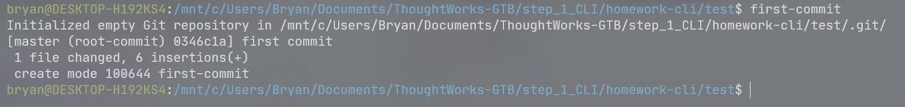

# homework-cli

1. 找到在 Ubuntu 系统中可以用于计算文件内容 [MD5](https://www.jianshu.com/p/81c30781d4f7) 值的命令

   * `md5sum`

   ```bash
   bryan@DESKTOP-H192KS4:/mnt/c/Users/Bryan/Documents/ThoughtWorks-GTB/step_1_CLI/demo-cli$ type md5sum
   md5sum is hashed (/usr/bin/md5sum)
   ```

2. 找到在 Ubuntu 系统中可以用于比较两个文件的内容的差异的命令

   * `diff`

   ```bash
   bryan@DESKTOP-H192KS4:/mnt/c/Users/Bryan/Documents/ThoughtWorks-GTB/step_1_CLI/demo-cli$ type diff
   diff is hashed (/usr/bin/diff)
   ```

3. 实现一个 名为 `odd-or-even` 的 Bash function，可以用来判断给其提供的第一个参数是奇数还是偶数，奇数时输出 `odd`，偶数时输出 `even`

   ```bash
   function odd-or-even(){
           if [ $(($1%2)) -eq 1 ];
           then    echo "odd"
           else    echo "even"
           fi
   }
   ```

4. 实现一个名为 `next` 的脚本(script)，当在 CLI 里执行 `$ next` （`$`为提示符，不需要输入）时就返回一个整数，第一次返回 1，每执行一次加1 

   ```bash
   #!/bin/bash
   
   function next(){
           num="$PWD/num_file";
           if [ -e $num ];then
                   next=`cat $num`
           else
                   next=0
           fi
           echo $next
           next=`expr $next + 1`
           echo $next > num_file
   }
   next
   ```

5. 一个文件含有 N 行内容，每行的内容都是一个大于等于 0 的整数，无任何空行或其它内容，使用 [one-liner](https://onceupon.github.io/Bash-Oneliner/) 的[形式](https://trello.com/1/cards/617b60a9afde39545d03357c/attachments/61d95874d93e3066da814a98/download/image.png)对该文件中的数字求和. 

   1. Create a file with 100 random numbers ranging between 1 and 300

      ```bash
      #!/bin/bash
      
      i=1
      file="$PWD/random_num"
      if [ ! -e $file ];then
              until [ $i -gt 100 ];
              do
                      echo $((1 + $RANDOM % 300)) >> random_num
                      let i++
              done
      fi
      ```

   2. Create a bash script that sums up the numbers in a file, takes the first argument as the file

      ```bash
      #!/bin/bash
      
      input="$PWD/$1"
      sum=0
      while IFS= read -r line
      do
              sum=`expr $sum + $line`
      done < "$input"
      echo $sum
      ```

6. 删除名为：-delete-me的文件。

   ```
   touch -- -delete-me
   ll -- -delete-me
   rm -- -delete-me
   ```

7. 写一个新的命令，通过定义新的function或者增加新的脚本，都可以。 在命令行中执行：`$ first-commit` 即可以在当前folder创建一个git repo，并把当前的文件提交，提交log为”first commit”。也可以支持参数：`$ first-commit abc`

   ```
   #!/bin/bash
   
   MESSAGE=${1:-first commit}
   git init
   git add .
   git commit -m "$MESSAGE"
   ```

8. 这里我们要实现一个用户自定义命令（command）：`topc` 。当用户执行该命令时，需要通过参数提供一个包含历史命令的文件 

   ```
   
   #!/bin/bash
   
   declare -r INPUT_FILE="${1}"
   
   sed -E 's/ +\| +/\n/g' "${INPUT_FILE}" | sed -E 's/^ +//' | sed -E 's/^(sudo||nohup) +//' | cut -d' ' -f1 | sed -E 's#^.*/##' | grep -E -v '^(ll||ls||cd||cat||vim||echo)$' | awk '{total++; cmds[$1]++;} END{for(cmd in cmds){printf "%d %f %s\n", cmds[cmd], cmds[cmd]/total*100, cmd;}}' | sort -t' ' -k1,1nr -k3,3 | head -n10 | awk '{printf "%4d %6.2f%% %s\n", $1, $2, $3;}'
   ```

   

